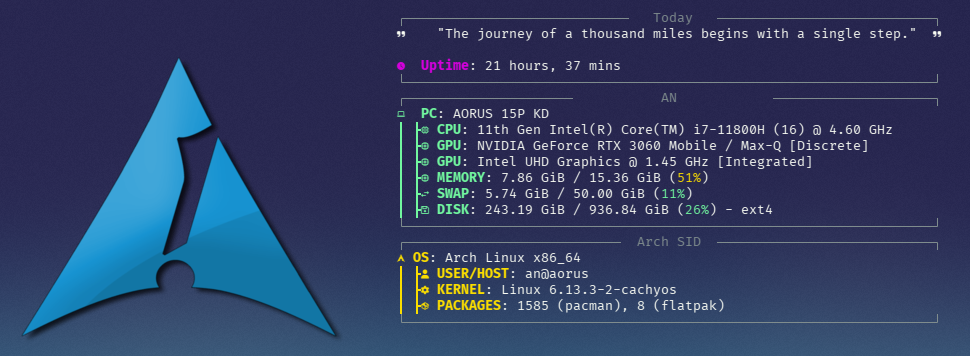

# 🚀 FastFetch Configuration

A beautifully customized FastFetch setup for Arch Linux.

## ✨ Features
- 🎨 Custom color scheme
- ⚡ Optimized for speed
- 📦 Modular configuration
- 🔧 Easy to install/update

## 📦 Installation
1. Install FastFetch:
   ```bash
   # Arch Linux
   yay -S fastfetch-git

   # Other distros
   git clone https://github.com/fastfetch-cli/fastfetch
   cd fastfetch && mkdir build && cd build
   cmake .. && make && sudo make install
   ```

2. Clone this repo:
   ```bash
   git clone https://github.com/4chref/fastfetch-config.git
   ```

3. Copy the config:
   ```bash
   mkdir -p ~/.config/fastfetch
   cp fastfetch-config/config.json ~/.config/fastfetch/config.json
   ```
   
## 🎨 Customization
Edit `config.json` to:
- Change logo/color scheme
- Rearrange modules
- Add custom ASCII art
```json
{
  "modules": [
    "title",
    "separator",
    "os",
    "host",
    "kernel"
  ],
  "logo": {
    "type": "kitty",
    "source": "/path/to/logo.png"
  }
}
```

## 📸 Screenshot
 

